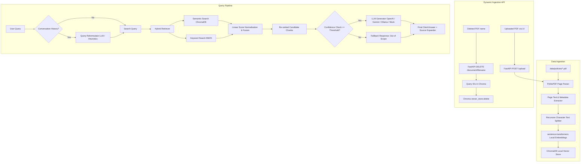

# PolicyPilot ✈️ — AI-Powered Enterprise Policy Assistant

PolicyPilot is an enterprise-grade Retrieval-Augmented Generation (RAG) knowledge assistant. It allows employees to query corporate HR, IT, travel, and conduct policies in natural language, receiving context-rich, source-cited responses (naming the specific document and page numbers).

Designed for high-reliability local deployment, it runs 100% offline using local embeddings and fallback heuristics, but can also plug into OpenAI, Gemini, or Ollama APIs seamlessly.

---

## 🏗️ System Architecture

PolicyPilot decouples data ingestion, high-recall retrieval, response generation, and client display using a FastAPI backend and a Streamlit frontend:



---

## ✨ Key Features

*   **Dynamic Document Library**: Add or remove PDF files directly in the user interface. Files are ingested, chunked, and stored in vector database memory in real time, and deleted transactionally without server restarts.
*   **Hybrid Retrieval (Cosine + BM25)**: Combines vector-based semantic similarity (capturing concepts) with BM25 keyword matching (capturing precise terms like codes, department names, or software names).
*   **Out-of-Scope Safeguards**: Rejects queries unrelated to policies (e.g. general knowledge questions) based on a calibrated retrieval confidence threshold, avoiding LLM hallucinations.
*   **Aesthetic UI**: Custom-branded interface using Outfit typography, harmonized deep blue gradient header panels, glassmorphism metrics widgets, and responsive layout.
*   **Side-by-Side Comparison Engine**: Compare semantic-only search results versus hybrid search results in real time.
*   **Offline Mode Support**: Fully functional offline fallback mode using a pre-packaged sentence-transformer embedding model (`all-MiniLM-L6-v2`) and local response heuristics.

---

## 📂 Project Structure

```
PolicyPilot/
├── .streamlit/
│   └── config.toml        # Native Streamlit client configuration
├── data/
│   ├── policies/          # Live directory holding PDF policy documents
│   ├── eval_qa.json       # Ground-truth evaluation dataset (20 QA pairs)
│   └── chromadb/          # Chroma vector store index database files
├── scripts/
│   └── generate_pdfs.py   # Script to generate synthetic test policy PDFs
├── src/
│   ├── __init__.py
│   ├── config.py          # Environment settings loader
│   ├── ingest.py          # Document loading, text splitting, and indexer
│   ├── retriever.py       # Hybrid retrieval and reranking logic
│   ├── generator.py       # LLM generation adapters (Mock, Ollama, OpenAI, Gemini)
│   ├── pipeline.py        # Pipeline coordinator with conversation memory
│   └── evaluate.py        # Automated test suite and grader
├── app.py                 # Streamlit web interface
├── api.py                 # FastAPI backend server
├── requirements.txt       # Dependencies list
├── .env                   # Active environment variables
└── README.md              # Project documentation
```

---

## 🛠️ Installation & Setup

Ensure you have **Python 3.11** installed.

### 1. Configure the Virtual Environment
Open your shell (PowerShell on Windows) and run:

```powershell
# Create virtual environment
py -3.11 -m venv venv

# Activate virtual environment
venv\Scripts\activate

# Install dependencies
pip install -r requirements.txt
```

### 2. Generate Synthetic Policies (Initial Test Run)
Create the sample policy documents (HR Leave, IT Support, Travel Expense, Code of Conduct, WFH Policy):
```powershell
python scripts/generate_pdfs.py
```

### 3. Ingest Documents
Process and index the PDFs into the Chroma vector database:
```powershell
python -m src.ingest
```

### 4. Run the Servers

PolicyPilot runs as a split architecture. Start both servers in separate terminal windows:

#### Terminal 1: Start the FastAPI Backend
```powershell
venv\Scripts\activate
python api.py
```
*(Runs on `http://127.0.0.1:8000`)*

#### Terminal 2: Start the Streamlit Frontend
```powershell
venv\Scripts\activate
streamlit run app.py
```
*(Runs on `http://localhost:8501`)*

---

## ⚙️ Environment Variables

Configure `.env` in the root folder. Copy the template from `.env.example`:

| Key | Description | Default |
| :--- | :--- | :--- |
| `LLM_PROVIDER` | Active LLM backend (`mock`, `ollama`, `openai`, `gemini`) | `mock` |
| `OLLAMA_HOST` | Endpoint of your local Ollama instance | `http://localhost:11434` |
| `OLLAMA_MODEL` | Local Ollama model name | `llama3` |
| `OPENAI_API_KEY` | OpenAI API authentication key (optional) | *None* |
| `OPENAI_MODEL` | OpenAI chat model choice | `gpt-4o-mini` |
| `GEMINI_API_KEY` | Google Gemini API key (optional) | *None* |
| `GEMINI_MODEL` | Google Gemini model choice | `gemini-1.5-flash` |
| `CHUNK_SIZE` | Text chunk size (characters) for document parser | `500` |
| `CHUNK_OVERLAP` | Overlap size between adjacent text chunks | `50` |
| `CONFIDENCE_THRESHOLD` | Score cutoff (0.0 to 1.0) for out-of-scope filter | `0.35` |
| `HYBRID_SEMANTIC_WEIGHT` | Reranking weight given to semantic search | `0.7` |
| `HYBRID_KEYWORD_WEIGHT` | Reranking weight given to keyword search | `0.3` |

---

## 🔌 API Endpoints (FastAPI)

The backend (`api.py`) exposes several endpoints:

*   `POST /query`: Submits a question, conversation history, search mode, and threshold. Returns the generated response, metadata, and citation references.
*   `GET /status`: Retrieves system info, including total document count, list of processed filenames, and vector store chunk count.
*   `POST /reindex`: Re-runs the ingestion pipeline across all PDFs stored in `data/policies/`.
*   `POST /upload`: Accepts PDF file binaries, saves them to `data/policies/`, and indexes them on-the-fly.
*   `DELETE /document/{filename}`: Removes a document from disk and deletes all associated chunks from the Chroma index.

---

## 📊 Evaluation System

The automated evaluation suite grades search recall and generation overlap metrics offline against a ground-truth dataset (`data/eval_qa.json`).

Run the evaluation:
```powershell
python -m src.evaluate
```

### Metrics Explained
1.  **Retrieval Recall@4 (Hit Rate)**: Measures whether the correct ground-truth page was included in the top 4 chunks. Targets **100%**.
2.  **Answer F1-Score**: Measures word-level overlap.
3.  **Semantic Cosine Similarity**: Uses the local MiniLM embedding model to calculate the semantic vector similarity between the generated answer and the ground truth.

Evaluation results are saved directly to [evaluation_report.md](file:///c:/Users/utkar/Desktop/PolicyPilot/evaluation_report.md).

---

## 💡 Engineering Decisions

*   **SQLite Windows File Lock Avoidance**: When deleting documents in Windows, attempting to delete the physical `data/chromadb` folder while FastAPI holds an active connection results in `WinError 32` (file lock). PolicyPilot avoids this by using Chroma's programmatic API (`vector_store.delete(ids=...)`) to selectively purge chunks transactionally, keeping SQLite locks safe.
*   **Dynamic BM25 Initialization**: BM25 requires an in-memory document corpus. Instead of saving a secondary static file, PolicyPilot reads document vectors directly from Chroma on launch and dynamically creates the BM25 search index.
*   **Minimalist Top-Bar**: Streamlit's default "Deploy" button is suppressed via a dual approach: natively setting `showDeployButton = false` in `.streamlit/config.toml` and applying custom CSS selector injections in `app.py` for older browser cache compatibilities.
